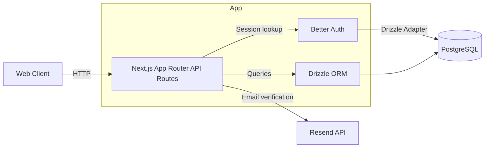
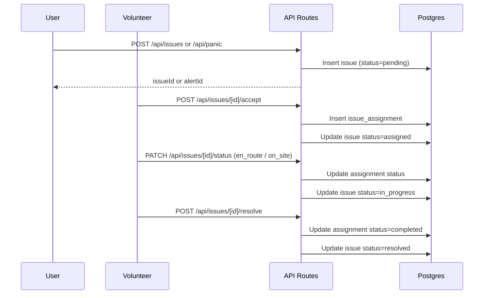
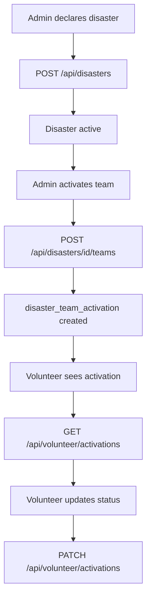

# Backend API Documentation - Bihar Sahayata

This document captures the backend API surface, routing, and architecture of the Bihar Sahayata app as implemented in this repo. It is based on the Next.js App Router API routes in `app/api`, the Drizzle schema in `db/schema.ts`, and auth/email utilities in `lib/`.

**Scope**
- API routes and behavior
- Auth and role rules
- Data model summary
- Architecture diagrams (Mermaid)

**Base URL**
- Local dev: `http://localhost:3000`
- All routes below are under `/api/...`

---

**Architecture Overview**

**Key Backend Components**
- Next.js App Router API handlers in `app/api/*/route.ts`
- Better Auth for sessions and user identity in `lib/auth.ts`
- Drizzle ORM with PostgreSQL in `db/drizzle.ts` and `db/schema.ts`
- Resend email service for verification in `lib/resend.ts`

---

**Data Model Summary (Core Tables)**
- `user` with role (`user`, `volunteer`, `admin`)
- `session`, `account`, `verification` for Better Auth
- `user_profile` for extended citizen profile
- `volunteer_profile`, `volunteer_qualification`, `volunteer_team`, `team_membership`
- `issue`, `issue_type`, `issue_assignment`
- `disaster`, `disaster_team_activation`
- `campaign`, `campaign_update`, `donation`
- `notification`

---

**Auth and Role Rules**
- Sessions are managed by Better Auth (`/api/auth/[...all]`).
- Role is stored on `user.role` and is checked directly from the DB in some routes.
- Admin-only checks are enforced in:
  - `POST /api/disasters`
  - `PATCH /api/disasters/[id]`
  - `POST /api/disasters/[id]/teams`
  - Admin routes under `/api/admin/*` (only session required in code, no explicit role check except disasters).
- Volunteer-only checks are enforced in:
  - `POST /api/teams` (must have `volunteer_profile`)
  - Volunteer profile and activations endpoints

---

**Routing Map (All API Endpoints)**

| Method | Path | Auth | Purpose |
| --- | --- | --- | --- |
| GET, POST | `/api/auth/[...all]` | As per provider | Better Auth handler (sign in, sign up, session) |
| POST | `/api/panic` | Public | Create panic alert (critical issue) |
| GET | `/api/panic` | Public | Get panic status by id |
| GET | `/api/issues` | Required | Role-based issue list |
| POST | `/api/issues` | Conditional | Create issue (auth if type requires it) |
| GET | `/api/issues/[id]` | Required | Issue detail + assignments |
| POST | `/api/issues/[id]/accept` | Required | Volunteer accepts issue |
| PATCH | `/api/issues/[id]/status` | Required | Update assignment status |
| POST | `/api/issues/[id]/resolve` | Required | Resolve issue |
| GET | `/api/disasters` | Public | List disasters |
| POST | `/api/disasters` | Admin | Declare disaster |
| GET | `/api/disasters/[id]` | Public | Disaster details + stats |
| PATCH | `/api/disasters/[id]` | Admin | Update disaster status |
| GET | `/api/disasters/[id]/issues` | Public | Issues for disaster |
| GET | `/api/disasters/[id]/teams` | Public | Activated teams for disaster |
| POST | `/api/disasters/[id]/teams` | Admin | Activate team for disaster |
| GET | `/api/campaigns` | Public | List campaigns |
| POST | `/api/campaigns` | Required | Create campaign (pending approval) |
| POST | `/api/donations` | Public | Donate to campaign |
| GET | `/api/donations` | Required | Donation history for user |
| GET | `/api/teams` | Public | List active teams |
| POST | `/api/teams` | Volunteer | Create team |
| GET | `/api/teams/[id]` | Public | Team details |
| PATCH | `/api/teams/[id]` | Leader | Update team |
| GET | `/api/teams/[id]/members` | Public | Team members |
| POST | `/api/teams/[id]/members` | Required | Join/add member |
| DELETE | `/api/teams/[id]/members` | Required | Leave/remove member |
| GET | `/api/volunteer/profile` | Required | Volunteer profile |
| PATCH | `/api/volunteer/profile` | Required | Update volunteer profile |
| POST | `/api/volunteer/onboard` | Required | Register as volunteer |
| GET | `/api/volunteer/activations` | Required | Disaster activations |
| PATCH | `/api/volunteer/activations` | Required | Update activation status |
| GET | `/api/user/profile` | Required | Get user profile |
| POST | `/api/user/profile` | Required | Create or update profile |
| PATCH | `/api/user/profile` | Required | Partial profile update |
| GET | `/api/user/issues` | Required | Issues reported by user |
| GET | `/api/user/donations` | Required | Donations by user |
| GET | `/api/admin/stats` | Required | Admin stats summary |
| GET | `/api/admin/issues` | Required | Admin issue list |
| PATCH | `/api/admin/issues` | Required | Admin update issue |
| GET | `/api/admin/campaigns` | Required | Admin campaign list |
| POST | `/api/admin/campaigns` | Required | Admin create campaign |
| PATCH | `/api/admin/campaigns` | Required | Admin update campaign |
| GET | `/api/admin/volunteers` | Required | Admin volunteer list |
| PATCH | `/api/admin/volunteers` | Required | Admin verify/update volunteer |

---

**Detailed Endpoint Reference**

**Auth**

`GET/POST /api/auth/[...all]`
- Handler: `toNextJsHandler(auth)`
- Purpose: Better Auth endpoints for sign in, sign up, sessions, providers
- Notes: Behavior depends on Better Auth configuration in `lib/auth.ts`

**Panic (SOS)**

`POST /api/panic`
- Auth: Public
- Body
  - `victimPhone` string, required
  - `latitude` number, required
  - `longitude` number, required
  - `description` string, optional
  - `victimName` string, optional
- Behavior
  - Looks up `issue_type` where `code = "panic"`
  - Creates `issue` with `severity = "critical"` and `status = "pending"`
  - Finds nearby volunteers within 20 km (available + verified)
- Response
  - `alertId`, `nearbyVolunteersCount`, `status`

`GET /api/panic?id=...`
- Auth: Public
- Query
  - `id` string, required
- Response
  - Limited issue status info: `status`, `severity`, `createdAt`, `acknowledgedAt`, `resolvedAt`

**Issues**

`POST /api/issues`
- Auth: Required if issue type requires auth
- Body
  - `issueTypeCode` string, default `general`
  - `victimPhone` string, required
  - `latitude`, `longitude` number, required
  - `victimName`, `victimAge`, `victimGender` optional
  - `reporterPhone`, `reporterName`, `reporterRelation` optional
  - `address`, `district`, `landmark` optional
  - `title`, `description` optional
  - `severity` optional
- Behavior
  - Loads issue type and enforces `requiresAuth`
  - Creates `issue` with `status = "pending"`
  - For `high` or `critical`, computes nearby volunteers within 15 km
- Response
  - `issueId`, `nearbyVolunteersNotified`, `status`

`GET /api/issues`
- Auth: Required
- Query
  - `status` optional
  - `lat`, `lng` optional for location filter
  - `radius` km, default `15`
  - `limit` default `50`
  - `my` set to `true` to force own issues
- Behavior
  - Admin: all issues
  - Volunteer: assigned issues plus nearby pending or acknowledged issues
  - User: own issues only
- Response
  - List of issues with `issueType`

`GET /api/issues/[id]`
- Auth: Required
- Behavior
  - Returns issue details, assignments, and a `myAssignment` block for current volunteer

`POST /api/issues/[id]/accept`
- Auth: Required (volunteer)
- Behavior
  - Creates `issue_assignment` for current volunteer
  - Updates issue status to `assigned`

`PATCH /api/issues/[id]/status`
- Auth: Required (volunteer)
- Body
  - `status` in `en_route` or `on_site`
- Behavior
  - Updates assignment status
  - Sets `arrivedAt` when `on_site`
  - Updates issue status to `in_progress`

`POST /api/issues/[id]/resolve`
- Auth: Required (volunteer)
- Body
  - `notes`, `equipmentUsed` optional
- Behavior
  - Completes assignment, resolves issue
  - Increments `volunteer_profile.totalResolves`

**Disasters**

`GET /api/disasters`
- Auth: Public
- Query
  - `status` default `active` or `all`
  - `limit` default `20`
- Response
  - Disasters with stats: activated teams, issues, relief campaigns

`POST /api/disasters`
- Auth: Admin
- Body
  - `disasterType`, `title`, `description`, `affectedDistricts`, `severity` required
  - `centerLatitude`, `centerLongitude`, `radiusKm`, `estimatedAffectedPeople`, `responseLevel`, `startedAt` optional
- Behavior
  - Validates type and severity
  - Creates disaster as `active`

`GET /api/disasters/[id]`
- Auth: Public
- Response
  - Disaster details with `affectedDistricts` parsed
  - Activated teams, issue count, linked campaigns

`PATCH /api/disasters/[id]`
- Auth: Admin
- Body
  - `status` optional (`active`, `contained`, `resolved`)
  - `responseLevel`, `containedAt`, `resolvedAt`, `description` optional

`GET /api/disasters/[id]/issues`
- Auth: Public
- Query
  - `status` optional
  - `limit` default `50`

`GET /api/disasters/[id]/teams`
- Auth: Public

`POST /api/disasters/[id]/teams`
- Auth: Admin
- Body
  - `teamId` required
  - `assignedArea`, `responsibilities` optional
- Behavior
  - Validates team and disaster
  - Prevents duplicate activation

**Campaigns**

`GET /api/campaigns`
- Auth: Public
- Query
  - `status` default `active` or `all`
  - `disaster` optional disaster id
  - `category` optional
  - `limit` default `20`
- Response
  - Campaigns with `progress` percentage

`POST /api/campaigns`
- Auth: Required
- Body
  - `title`, `description`, `goalAmount`, `category` required
  - `story`, `coverImage`, `disasterId`, `beneficiaryName`, `beneficiaryType`, `startDate`, `endDate` optional
- Behavior
  - `goalAmount` is treated as rupees and converted to paisa
  - Status set to `pending_approval`

**Donations**

`POST /api/donations`
- Auth: Public
- Body
  - `campaignId` optional
  - `amount` number, required (rupees)
  - `donorName`, `donorEmail`, `donorPhone` optional
  - `isAnonymous` boolean optional
  - `message` optional
- Behavior
  - If `campaignId` omitted, uses first active campaign
  - Payment is marked `completed` with provider `demo`
  - Updates `campaign.raisedAmount` and `campaign.donorCount`

`GET /api/donations`
- Auth: Required
- Response
  - Donations for current user with campaign

**Teams**

`GET /api/teams`
- Auth: Public
- Query
  - `district`, `type` optional
  - `limit` default `50`
- Response
  - Active teams only

`POST /api/teams`
- Auth: Volunteer
- Body
  - `name`, `teamType`, `district` required
  - `description`, `logo`, `latitude`, `longitude` optional
- Behavior
  - Creates team and leader membership

`GET /api/teams/[id]`
- Auth: Public
- Response
  - Team, leader info, active members

`PATCH /api/teams/[id]`
- Auth: Leader
- Body
  - `name`, `description`, `teamType`, `isActive` optional

`GET /api/teams/[id]/members`
- Auth: Public

`POST /api/teams/[id]/members`
- Auth: Required
- Body
  - `volunteerId` optional
  - `role` optional
- Behavior
  - Self join allowed
  - Adding others requires leader
  - Reactivates existing membership when present

`DELETE /api/teams/[id]/members`
- Auth: Required
- Query
  - `volunteerId` optional
- Behavior
  - Leader cannot leave own team
  - Leader can remove others

**Volunteer**

`POST /api/volunteer/onboard`
- Auth: Required
- Body
  - `displayName`, `phone`, `age`, `latitude`, `longitude`, `district` required
  - `address`, `bio`, `specializations`, `serviceRadius` optional
- Behavior
  - Creates volunteer profile
  - Updates `user.role` to `volunteer`

`GET /api/volunteer/profile`
- Auth: Required
- Response
  - Volunteer profile, qualifications, team memberships

`PATCH /api/volunteer/profile`
- Auth: Required
- Body
  - Editable fields only: `displayName`, `phone`, `age`, `bio`, `profileImage`, `latitude`, `longitude`, `district`, `address`, `serviceRadius`, `specializations`, `isAvailable`

`GET /api/volunteer/activations`
- Auth: Required
- Response
  - Disaster activations for volunteer team memberships
  - Only active or contained disasters

`PATCH /api/volunteer/activations`
- Auth: Required
- Body
  - `activationId` required
  - `status` in `deployed` or `completed`

**User**

`GET /api/user/profile`
- Auth: Required
- Response
  - If no profile, returns `hasProfile: false` with basic user info

`POST /api/user/profile`
- Auth: Required
- Body
  - Full profile fields; creates or updates

`PATCH /api/user/profile`
- Auth: Required
- Body
  - Partial profile update

`GET /api/user/issues`
- Auth: Required
- Response
  - Issues reported by current user with assignment info

`GET /api/user/donations`
- Auth: Required
- Response
  - Donations by user + total completed amount

**Admin**

`GET /api/admin/stats`
- Auth: Required
- Response
  - Aggregates counts of users, volunteers, teams, issues, campaigns, disasters, donations

`GET /api/admin/issues`
- Auth: Required
- Query
  - `status`, `severity`, `district`, `limit`

`PATCH /api/admin/issues`
- Auth: Required
- Body
  - `issueId` required
  - `status`, `severity` optional

`GET /api/admin/campaigns`
- Auth: Required
- Query
  - `status`, `category`, `limit`

`POST /api/admin/campaigns`
- Auth: Required
- Body
  - `title`, `description`, `goalAmount`, `category` required
  - `goalAmount` is expected in paisa in this admin route
  - `story`, `disasterId`, `beneficiaryName`, `beneficiaryType`, `coverImage`, `videoUrl`, `status` optional
- Behavior
  - Auto-verified and active by default

`PATCH /api/admin/campaigns`
- Auth: Required
- Body
  - `campaignId` required
  - `status` optional
  - `isVerified` optional

`GET /api/admin/volunteers`
- Auth: Required
- Query
  - `search`, `verified`, `district`, `limit`

`PATCH /api/admin/volunteers`
- Auth: Required
- Body
  - `volunteerId` required
  - `isVerified`, `rank` optional

---

**Mermaid: Issue Resolution Flow (High Level)**

**Mermaid: Disaster Activation Flow**

---

**Notes and Implementation Details**
- Email verification is required for email/password auth.
- Admin role enforcement is strict for disaster creation and updates, but some admin routes only check authentication. Consider adding role checks if needed.
- Campaign `goalAmount` units differ between user and admin creation:
  - `/api/campaigns` expects rupees and converts to paisa.
  - `/api/admin/campaigns` expects paisa directly.
- Notifications to volunteers for panic/high severity are currently TODO (no push/SMS/websocket implementation yet).

---

**Source References (Key Files)**
- API routes: `app/api/**/route.ts`
- Auth config: `lib/auth.ts`
- DB schema: `db/schema.ts`
- DB connection: `db/drizzle.ts`
- Geo utilities: `lib/geo.ts`
- Email: `lib/resend.ts`

