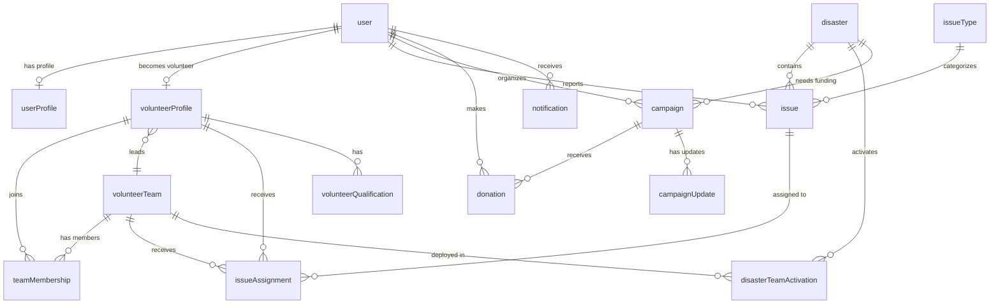

# Bihar Sahayata - Public Welfare & Disaster Management Platform

## Vision

Building a comprehensive **public welfare organization platform** for Bihar that handles:
- 🚨 **Critical Panic Alerts** - Anonymous emergency triggers for life-threatening situations
- 👤 **User Issue Reporting** - Authenticated users report harassment, medical emergencies, etc.
- 🙋 **Volunteer Management** - Individuals and teams responding to incidents
- 🌊 **Disaster Response** - Coordinated team activation during natural disasters
- 💰 **Fundraising & Charity** - Campaigns for relief, medical aid, and community support

---

## Architecture Overview

```mermaid
graph TB
    subgraph "Public Access"
        A[🚨 Panic Alert] --> B[Alert System]
        C[💰 Donate] --> D[Fundraising]
    end
    
    subgraph "Authenticated Users"
        E[👤 User Profile] --> F[Issue Reporting]
        F --> G[Harassment]
        F --> H[Medical Emergency]
        F --> I[General Help]
    end
    
    subgraph "Volunteer System"
        J[Individual Volunteers]
        K[Volunteer Teams]
        J --> L[Alert Assignment]
        K --> L
        L --> M[Resolution & Reporting]
    end
    
    subgraph "Disaster Management"
        N[🌊 Disaster Declaration]
        N --> O[Team Activation]
        N --> P[Relief Campaigns]
        O --> K
        P --> D
    end
    
    B --> L
    F --> L
```



---

## User Review Required

> [!NOTE]
> **Email Verification** will be used for volunteer onboarding (as per your feedback). Phone numbers will be collected but not OTP verified.

> [!IMPORTANT]
> **Extensible Issue Types**: The schema supports adding new issue categories easily. Initial types: `harassment`, `medical_emergency`, `accident`, `fire`, `flood`, `general`. Should we add more?

> [!IMPORTANT]
> **Fundraising Integration**: For payment processing, we'll need a payment gateway (Razorpay recommended for India). Should I include the integration in this phase or keep it as a future enhancement?

---

## Proposed Changes

### Database Schema Component

Summary: Creating an extensible schema architecture that supports users, volunteers, teams, issues, disasters, and fundraising.

---

#### [MODIFY] [schema.ts](file:///d:/nextJs(techcure)/techcure2026/db/schema.ts)

### Core Schemas

**1. User Profile Extension** (extends Better Auth user)
```typescript
export const userProfile = pgTable("user_profile", {
  id: text("id").primaryKey(),
  userId: text("user_id")
    .notNull()
    .references(() => user.id, { onDelete: "cascade" }),
  
  // Personal Info
  phone: text("phone"),
  alternatePhone: text("alternate_phone"),
  dateOfBirth: timestamp("date_of_birth"),
  gender: text("gender"), // male, female, other
  bloodGroup: text("blood_group"),
  
  // Location
  latitude: doublePrecision("latitude"),
  longitude: doublePrecision("longitude"),
  district: text("district"),
  address: text("address"),
  pincode: text("pincode"),
  
  // Emergency Contact
  emergencyContactName: text("emergency_contact_name"),
  emergencyContactPhone: text("emergency_contact_phone"),
  emergencyContactRelation: text("emergency_contact_relation"),
  
  createdAt: timestamp("created_at").defaultNow().notNull(),
  updatedAt: timestamp("updated_at").defaultNow().$onUpdate(() => new Date()).notNull(),
}, (table) => [
  index("user_profile_userId_idx").on(table.userId),
  index("user_profile_district_idx").on(table.district),
]);
```

---

### Volunteer System Schemas

**2. Volunteer Profile**
```typescript
export const volunteerProfile = pgTable("volunteer_profile", {
  id: text("id").primaryKey(),
  userId: text("user_id")
    .notNull()
    .references(() => user.id, { onDelete: "cascade" }),
  
  // Basic Info
  displayName: text("display_name").notNull(),
  phone: text("phone").notNull(),
  age: integer("age").notNull(),
  profileImage: text("profile_image"),
  bio: text("bio"),
  
  // Rank & Experience
  rank: text("rank").notNull().default("beginner"), // beginner, trained, advanced, expert, leader
  experienceYears: integer("experience_years").default(0),
  
  // Specializations (stored as JSON array)
  specializations: text("specializations"), // ["first_aid", "rescue", "counseling", "medical"]
  
  // Location
  latitude: doublePrecision("latitude").notNull(),
  longitude: doublePrecision("longitude").notNull(),
  district: text("district").notNull(),
  address: text("address"),
  serviceRadius: integer("service_radius").default(10), // km
  
  // Stats
  totalResolves: integer("total_resolves").default(0).notNull(),
  totalDonations: integer("total_donations").default(0), // amount in paisa
  rating: doublePrecision("rating").default(5.0),
  
  // Status
  isAvailable: boolean("is_available").default(true).notNull(),
  isVerified: boolean("is_verified").default(false).notNull(),
  verifiedAt: timestamp("verified_at"),
  
  createdAt: timestamp("created_at").defaultNow().notNull(),
  updatedAt: timestamp("updated_at").defaultNow().$onUpdate(() => new Date()).notNull(),
}, (table) => [
  index("volunteer_userId_idx").on(table.userId),
  index("volunteer_district_idx").on(table.district),
  index("volunteer_location_idx").on(table.latitude, table.longitude),
  index("volunteer_available_idx").on(table.isAvailable, table.isVerified),
  index("volunteer_rank_idx").on(table.rank),
]);
```

**3. Volunteer Teams**
```typescript
export const volunteerTeam = pgTable("volunteer_team", {
  id: text("id").primaryKey(),
  name: text("name").notNull(),
  description: text("description"),
  logo: text("logo"),
  
  // Team Type
  teamType: text("team_type").notNull().default("general"), // rescue, medical, relief, general
  
  // Location
  district: text("district").notNull(),
  latitude: doublePrecision("latitude"),
  longitude: doublePrecision("longitude"),
  
  // Leadership
  leaderId: text("leader_id")
    .notNull()
    .references(() => volunteerProfile.id),
  
  // Stats
  memberCount: integer("member_count").default(1).notNull(),
  totalResolves: integer("total_resolves").default(0).notNull(),
  
  isActive: boolean("is_active").default(true).notNull(),
  createdAt: timestamp("created_at").defaultNow().notNull(),
  updatedAt: timestamp("updated_at").defaultNow().$onUpdate(() => new Date()).notNull(),
}, (table) => [
  index("team_district_idx").on(table.district),
  index("team_type_idx").on(table.teamType),
  index("team_leader_idx").on(table.leaderId),
]);
```

**4. Team Membership**
```typescript
export const teamMembership = pgTable("team_membership", {
  id: text("id").primaryKey(),
  teamId: text("team_id")
    .notNull()
    .references(() => volunteerTeam.id, { onDelete: "cascade" }),
  volunteerId: text("volunteer_id")
    .notNull()
    .references(() => volunteerProfile.id, { onDelete: "cascade" }),
  
  role: text("role").notNull().default("member"), // leader, co-leader, member
  joinedAt: timestamp("joined_at").defaultNow().notNull(),
  isActive: boolean("is_active").default(true).notNull(),
}, (table) => [
  index("membership_team_idx").on(table.teamId),
  index("membership_volunteer_idx").on(table.volunteerId),
]);
```

---

### Issue & Alert System Schemas

**5. Issue Types** (configurable)
```typescript
export const issueType = pgTable("issue_type", {
  id: text("id").primaryKey(),
  code: text("code").notNull().unique(), // harassment, medical_emergency, accident, etc.
  name: text("name").notNull(),
  nameHindi: text("name_hindi"),
  description: text("description"),
  icon: text("icon"),
  color: text("color"), // for UI
  
  // Configuration
  requiresAuth: boolean("requires_auth").default(true).notNull(),
  defaultSeverity: text("default_severity").default("medium"),
  autoAssignTeamType: text("auto_assign_team_type"), // which team type to notify
  
  isActive: boolean("is_active").default(true).notNull(),
  sortOrder: integer("sort_order").default(0),
});
```

**6. Issue/Alert** (unified table for all types)
```typescript
export const issue = pgTable("issue", {
  id: text("id").primaryKey(),
  
  // Type
  issueTypeId: text("issue_type_id")
    .notNull()
    .references(() => issueType.id),
  
  // Reporter (nullable for anonymous panic)
  reporterUserId: text("reporter_user_id")
    .references(() => user.id),
  
  // Victim/Affected Info
  victimName: text("victim_name"),
  victimPhone: text("victim_phone").notNull(),
  victimAge: integer("victim_age"),
  victimGender: text("victim_gender"),
  
  // Reporter Info (if different from victim)
  reporterName: text("reporter_name"),
  reporterPhone: text("reporter_phone"),
  reporterRelation: text("reporter_relation"), // self, family, bystander
  
  // Location
  latitude: doublePrecision("latitude").notNull(),
  longitude: doublePrecision("longitude").notNull(),
  address: text("address"),
  district: text("district"),
  landmark: text("landmark"),
  
  // Issue Details
  title: text("title"),
  description: text("description"),
  severity: text("severity").notNull().default("medium"), // low, medium, high, critical
  
  // Media (JSON array of URLs)
  mediaUrls: text("media_urls"),
  
  // Status Workflow
  status: text("status").notNull().default("pending"), 
  // pending -> acknowledged -> assigned -> in_progress -> resolved | escalated | cancelled
  
  // Linked Disaster (if part of disaster response)
  disasterId: text("disaster_id")
    .references(() => disaster.id),
  
  // Resolution
  resolvedAt: timestamp("resolved_at"),
  resolutionNotes: text("resolution_notes"),
  resolutionRating: integer("resolution_rating"), // 1-5 stars
  
  // Timestamps
  createdAt: timestamp("created_at").defaultNow().notNull(),
  updatedAt: timestamp("updated_at").defaultNow().$onUpdate(() => new Date()).notNull(),
  acknowledgedAt: timestamp("acknowledged_at"),
}, (table) => [
  index("issue_type_idx").on(table.issueTypeId),
  index("issue_status_idx").on(table.status),
  index("issue_location_idx").on(table.latitude, table.longitude),
  index("issue_district_idx").on(table.district),
  index("issue_created_idx").on(table.createdAt),
  index("issue_reporter_idx").on(table.reporterUserId),
  index("issue_disaster_idx").on(table.disasterId),
]);
```

**7. Issue Assignment**
```typescript
export const issueAssignment = pgTable("issue_assignment", {
  id: text("id").primaryKey(),
  issueId: text("issue_id")
    .notNull()
    .references(() => issue.id, { onDelete: "cascade" }),
  
  // Assigned to (volunteer or team)
  volunteerId: text("volunteer_id")
    .references(() => volunteerProfile.id),
  teamId: text("team_id")
    .references(() => volunteerTeam.id),
  
  // Status
  status: text("status").notNull().default("assigned"), 
  // assigned -> accepted -> en_route -> on_site -> completed | dropped
  
  // Actions
  equipmentUsed: text("equipment_used"),
  notes: text("notes"),
  
  // Timestamps
  assignedAt: timestamp("assigned_at").defaultNow().notNull(),
  acceptedAt: timestamp("accepted_at"),
  arrivedAt: timestamp("arrived_at"),
  completedAt: timestamp("completed_at"),
}, (table) => [
  index("assignment_issue_idx").on(table.issueId),
  index("assignment_volunteer_idx").on(table.volunteerId),
  index("assignment_team_idx").on(table.teamId),
]);
```

---

### Disaster Management Schemas

**8. Disaster Declaration**
```typescript
export const disaster = pgTable("disaster", {
  id: text("id").primaryKey(),
  
  // Type
  disasterType: text("disaster_type").notNull(), // flood, earthquake, cyclone, drought, fire, pandemic
  
  // Details
  title: text("title").notNull(),
  description: text("description").notNull(),
  
  // Affected Area
  affectedDistricts: text("affected_districts").notNull(), // JSON array
  centerLatitude: doublePrecision("center_latitude"),
  centerLongitude: doublePrecision("center_longitude"),
  radiusKm: integer("radius_km"),
  
  // Severity & Impact
  severity: text("severity").notNull(), // minor, moderate, severe, catastrophic
  estimatedAffectedPeople: integer("estimated_affected_people"),
  
  // Status
  status: text("status").notNull().default("active"), // active, contained, resolved
  
  // Response
  responseLevel: text("response_level").default("local"), // local, district, state, national
  
  // Timestamps
  startedAt: timestamp("started_at").notNull(),
  containedAt: timestamp("contained_at"),
  resolvedAt: timestamp("resolved_at"),
  createdAt: timestamp("created_at").defaultNow().notNull(),
  updatedAt: timestamp("updated_at").defaultNow().$onUpdate(() => new Date()).notNull(),
}, (table) => [
  index("disaster_type_idx").on(table.disasterType),
  index("disaster_status_idx").on(table.status),
  index("disaster_started_idx").on(table.startedAt),
]);
```

**9. Disaster Team Activation**
```typescript
export const disasterTeamActivation = pgTable("disaster_team_activation", {
  id: text("id").primaryKey(),
  disasterId: text("disaster_id")
    .notNull()
    .references(() => disaster.id, { onDelete: "cascade" }),
  teamId: text("team_id")
    .notNull()
    .references(() => volunteerTeam.id),
  
  // Assignment
  assignedArea: text("assigned_area"),
  responsibilities: text("responsibilities"),
  
  // Status
  status: text("status").notNull().default("activated"), // activated, deployed, completed
  
  activatedAt: timestamp("activated_at").defaultNow().notNull(),
  deployedAt: timestamp("deployed_at"),
  completedAt: timestamp("completed_at"),
}, (table) => [
  index("activation_disaster_idx").on(table.disasterId),
  index("activation_team_idx").on(table.teamId),
]);
```

---

### Fundraising & Charity Schemas

**10. Fundraising Campaign**
```typescript
export const campaign = pgTable("campaign", {
  id: text("id").primaryKey(),
  
  // Campaign Info
  title: text("title").notNull(),
  slug: text("slug").notNull().unique(),
  description: text("description").notNull(),
  story: text("story"), // detailed story in markdown
  
  // Media
  coverImage: text("cover_image"),
  galleryImages: text("gallery_images"), // JSON array
  videoUrl: text("video_url"),
  
  // Goals
  goalAmount: integer("goal_amount").notNull(), // in paisa
  raisedAmount: integer("raised_amount").default(0).notNull(),
  donorCount: integer("donor_count").default(0).notNull(),
  
  // Category
  category: text("category").notNull(), // disaster_relief, medical, education, community
  
  // Linked Disaster (optional)
  disasterId: text("disaster_id")
    .references(() => disaster.id),
  
  // Beneficiary
  beneficiaryName: text("beneficiary_name"),
  beneficiaryType: text("beneficiary_type"), // individual, family, community, organization
  
  // Organizer
  organizerId: text("organizer_id")
    .notNull()
    .references(() => user.id),
  
  // Status
  status: text("status").notNull().default("draft"), // draft, pending_approval, active, completed, cancelled
  
  // Verification
  isVerified: boolean("is_verified").default(false).notNull(),
  verifiedBy: text("verified_by"),
  verifiedAt: timestamp("verified_at"),
  
  // Timeline
  startDate: timestamp("start_date"),
  endDate: timestamp("end_date"),
  
  createdAt: timestamp("created_at").defaultNow().notNull(),
  updatedAt: timestamp("updated_at").defaultNow().$onUpdate(() => new Date()).notNull(),
}, (table) => [
  index("campaign_slug_idx").on(table.slug),
  index("campaign_category_idx").on(table.category),
  index("campaign_status_idx").on(table.status),
  index("campaign_organizer_idx").on(table.organizerId),
  index("campaign_disaster_idx").on(table.disasterId),
]);
```

**11. Donations**
```typescript
export const donation = pgTable("donation", {
  id: text("id").primaryKey(),
  
  // Campaign
  campaignId: text("campaign_id")
    .notNull()
    .references(() => campaign.id),
  
  // Donor (optional - can be anonymous)
  donorUserId: text("donor_user_id")
    .references(() => user.id),
  donorName: text("donor_name"),
  donorEmail: text("donor_email"),
  donorPhone: text("donor_phone"),
  isAnonymous: boolean("is_anonymous").default(false).notNull(),
  
  // Amount
  amount: integer("amount").notNull(), // in paisa
  currency: text("currency").default("INR").notNull(),
  
  // Payment
  paymentProvider: text("payment_provider"), // razorpay, upi, bank_transfer
  paymentId: text("payment_id"),
  paymentStatus: text("payment_status").notNull().default("pending"), // pending, completed, failed, refunded
  
  // Message
  message: text("message"),
  
  createdAt: timestamp("created_at").defaultNow().notNull(),
  completedAt: timestamp("completed_at"),
}, (table) => [
  index("donation_campaign_idx").on(table.campaignId),
  index("donation_donor_idx").on(table.donorUserId),
  index("donation_status_idx").on(table.paymentStatus),
]);
```

**12. Campaign Updates**
```typescript
export const campaignUpdate = pgTable("campaign_update", {
  id: text("id").primaryKey(),
  campaignId: text("campaign_id")
    .notNull()
    .references(() => campaign.id, { onDelete: "cascade" }),
  
  title: text("title").notNull(),
  content: text("content").notNull(),
  mediaUrls: text("media_urls"), // JSON array
  
  createdAt: timestamp("created_at").defaultNow().notNull(),
}, (table) => [
  index("update_campaign_idx").on(table.campaignId),
]);
```

---

### Supporting Schemas

**13. Bihar Districts**
```typescript
export const biharDistrict = pgTable("bihar_district", {
  id: text("id").primaryKey(),
  name: text("name").notNull().unique(),
  nameHindi: text("name_hindi"),
  division: text("division"), // Patna, Tirhut, Saran, etc.
  latitude: doublePrecision("latitude").notNull(),
  longitude: doublePrecision("longitude").notNull(),
  population: integer("population"),
  isActive: boolean("is_active").default(true).notNull(),
});
```

**14. Volunteer Qualifications**
```typescript
export const volunteerQualification = pgTable("volunteer_qualification", {
  id: text("id").primaryKey(),
  volunteerId: text("volunteer_id")
    .notNull()
    .references(() => volunteerProfile.id, { onDelete: "cascade" }),
  
  qualificationType: text("qualification_type").notNull(), 
  // first_aid, cpr, swimming, driving, medical, counseling, rescue
  
  certificateUrl: text("certificate_url"),
  issuedBy: text("issued_by"),
  issuedAt: timestamp("issued_at"),
  expiresAt: timestamp("expires_at"),
  isVerified: boolean("is_verified").default(false).notNull(),
  
  createdAt: timestamp("created_at").defaultNow().notNull(),
}, (table) => [
  index("qual_volunteer_idx").on(table.volunteerId),
  index("qual_type_idx").on(table.qualificationType),
]);
```

**15. Notifications**
```typescript
export const notification = pgTable("notification", {
  id: text("id").primaryKey(),
  userId: text("user_id")
    .notNull()
    .references(() => user.id, { onDelete: "cascade" }),
  
  type: text("type").notNull(), // issue_assigned, donation_received, team_invite, etc.
  title: text("title").notNull(),
  body: text("body"),
  data: text("data"), // JSON with additional data
  
  isRead: boolean("is_read").default(false).notNull(),
  readAt: timestamp("read_at"),
  
  createdAt: timestamp("created_at").defaultNow().notNull(),
}, (table) => [
  index("notification_user_idx").on(table.userId),
  index("notification_read_idx").on(table.isRead),
]);
```

---

## Database Schema Diagram



---

## API Routes Structure

### Public APIs (No Auth)
| Endpoint | Method | Description |
|----------|--------|-------------|
| `/api/panic` | POST | Create critical panic alert |
| `/api/campaigns` | GET | List active campaigns |
| `/api/campaigns/[slug]` | GET | View campaign details |
| `/api/donate` | POST | Process donation |

### User APIs (Auth Required)
| Endpoint | Method | Description |
|----------|--------|-------------|
| `/api/user/profile` | GET/POST | User profile management |
| `/api/user/issues` | GET/POST | Report and view issues |
| `/api/user/donations` | GET | View donation history |

### Volunteer APIs (Volunteer Auth)
| Endpoint | Method | Description |
|----------|--------|-------------|
| `/api/volunteer/onboard` | POST | Become a volunteer |
| `/api/volunteer/profile` | GET/PATCH | Manage volunteer profile |
| `/api/volunteer/alerts` | GET | View nearby alerts |
| `/api/volunteer/assignments` | GET/POST | Manage assignments |

### Team APIs
| Endpoint | Method | Description |
|----------|--------|-------------|
| `/api/teams` | GET/POST | List/create teams |
| `/api/teams/[id]/members` | GET/POST | Manage members |
| `/api/teams/[id]/activate` | POST | Activate for disaster |

### Admin APIs
| Endpoint | Method | Description |
|----------|--------|-------------|
| `/api/admin/disasters` | POST | Declare disaster |
| `/api/admin/campaigns/verify` | POST | Verify campaign |
| `/api/admin/volunteers/verify` | POST | Verify volunteer |

---

## UI Pages Structure

```
app/
├── (public)/
│   ├── panic/page.tsx           # 🚨 Emergency panic button
│   ├── campaigns/page.tsx       # 💰 Browse campaigns
│   ├── campaigns/[slug]/page.tsx
│   └── donate/[slug]/page.tsx
│
├── (auth)/
│   ├── login/page.tsx
│   ├── signup/page.tsx
│   └── verify-email/page.tsx
│
├── (user)/
│   ├── dashboard/page.tsx       # User dashboard
│   ├── profile/page.tsx         # Edit profile
│   ├── report/page.tsx          # Report issue
│   ├── my-issues/page.tsx       # View reported issues
│   └── my-donations/page.tsx    # Donation history
│
├── volunteer/
│   ├── onboard/page.tsx         # Become volunteer
│   ├── dashboard/page.tsx       # Volunteer dashboard
│   ├── alerts/page.tsx          # View nearby alerts
│   ├── alerts/[id]/page.tsx     # Alert detail & action
│   ├── team/page.tsx            # My team
│   └── profile/page.tsx         # Volunteer profile
│
├── teams/
│   ├── page.tsx                 # Browse teams
│   ├── create/page.tsx          # Create team
│   └── [id]/page.tsx            # Team detail
│
└── admin/
    ├── dashboard/page.tsx
    ├── disasters/page.tsx       # Manage disasters
    ├── campaigns/page.tsx       # Review campaigns
    └── volunteers/page.tsx      # Verify volunteers
```

---

## Verification Plan

### Automated Tests

1. **Schema Migration**
```bash
npx drizzle-kit generate
npx drizzle-kit push
```

2. **Seed Data**
- Seed Bihar districts (38 districts)
- Seed issue types
- Create test users and volunteers

### Manual Verification

1. **User Flow**
   - Sign up → Verify email → Complete profile → Report issue

2. **Volunteer Flow**
   - Sign up → Verify email → Onboard as volunteer → Receive alerts → Resolve

3. **Team Flow**
   - Create team → Invite members → Activate for disaster

4. **Campaign Flow**
   - Create campaign → Admin approval → Receive donations → Post updates

5. **Panic Alert**
   - Trigger anonymous alert → Volunteers notified → Resolution
